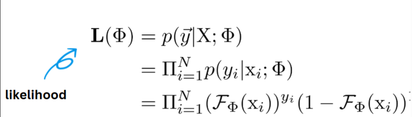
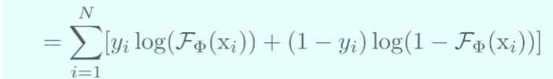
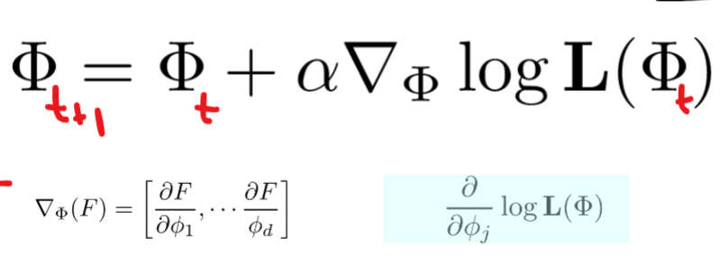
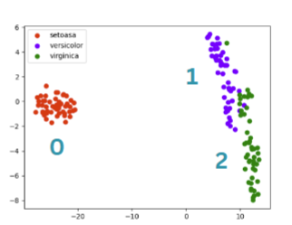
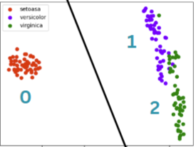
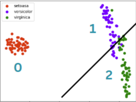
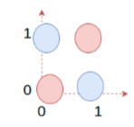
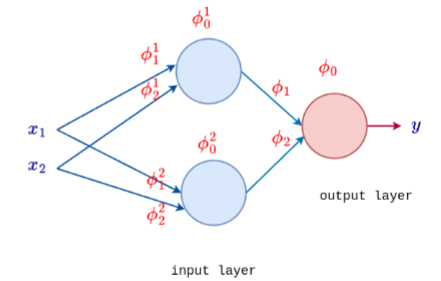

### apuntes

X son las entradas y $\phi$ son los parametros

$\alpha$ es el learning rate

### Clase 3 

#### Modelos lineales

El maximum likelihood es: 

Es siempre 0 o 1, de clasificación binaria.\
Es la probabilidad de correctitud.

A la hora de entrenar el modelo se busca maximizar el likelihood buscando unos buenos parametros, al revez del loss, que se trata de minimizar.

$$
 A_i = \sum_{j = 0}^d X_j \Gamma_j
$$

$\hat{y} = {es\:la\:prediccion}$

${y} = {es\:la\:variable}$

##### Modelos de las flores

Aca lo que se hace es que se va comparando un caso con el resto, si por ejemplo estamos viendo el caso 0, es 1 si la respuesta da 0, pero si es otro, como el 3 da 0.\ Nos podemos fijar que es linal ¿mente separables, el rojo esta separado por una linea invisible que separa el 0 con el resto.

aca se compara el 0 contra todos 

aca se corta linealmente entre el 1 y el 2, no se ve el caso de 0, no influye.

### Redes neuronales

*esta imagen resume un poco lo que se hablo antes*

Los valores de entrada siempre tienen que respresentarse en numeros

cuando las clases estan separadas por un hiperplano, entre mas a un lado este, mas seguro es que la respuesta esta correcta, entre mas cerca, mas duda pone, por eso la funcion sigmoidal funciona, por que si es positivo es una clase y si es negativo es otra.

Loss: mide el error entre la prediccion $\hat{y}$ y el valor real $y$

Mean square error: $L_i(\phi, x_i) = \frac{1}{2}(\hat{y_i}- y_i)^2$\
esta para uso general

binary cross entropy: $L_i(\phi, x_i) = -[y_ilog(\hat{y_i}) + (1-y_i)log(1-\hat{y_i})]$\ esta se ocupa literalmente para problemas de 0 o 1, independiente si se compara una clase con muchas, 1 vs all

general cross entropy: $L_i(\phi, x_i) = -log(\hat{y_i}^*)$\
esta se ocupa para clasificacion

**ver los ejemplos del profe slide 14, 15 y 16**

Cuando no hay un hiperplano que pueda separar las dos clases se necesitan mas neuronas como el caso del XOR

Como podemos ver hay dos neuronas que pueden resolver esto.

