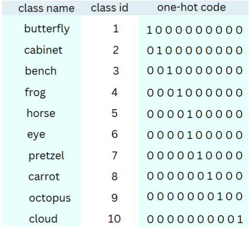

### apuntes

X son las entradas y $\phi$ son los parametros

$\alpha$ es el learning rate

### Clase 3 

#### Modelos lineales

El maximum likelihood es: 

Es siempre 0 o 1, de clasificación binaria.\
Es la probabilidad de correctitud.

A la hora de entrenar el modelo se busca maximizar el likelihood buscando unos buenos parametros, al revez del loss, que se trata de minimizar.

$$
 A_i = \sum_{j = 0}^d X_j \Gamma_j
$$

$\hat{y} = {es\:la\:prediccion}$

${y} = {es\:la\:variable}$

##### Modelos de las flores

Aca lo que se hace es que se va comparando un caso con el resto, si por ejemplo estamos viendo el caso 0, es 1 si la respuesta da 0, pero si es otro, como el 3 da 0.\ Nos podemos fijar que es linal ¿mente separables, el rojo esta separado por una linea invisible que separa el 0 con el resto.

aca se compara el 0 contra todos 

aca se corta linealmente entre el 1 y el 2, no se ve el caso de 0, no influye.

### Redes neuronales

*esta imagen resume un poco lo que se hablo antes*

Los valores de entrada siempre tienen que respresentarse en numeros

cuando las clases estan separadas por un hiperplano, entre mas a un lado este, mas seguro es que la respuesta esta correcta, entre mas cerca, mas duda pone, por eso la funcion sigmoidal funciona, por que si es positivo es una clase y si es negativo es otra.

Loss: mide el error entre la prediccion $\hat{y}$ y el valor real $y$

Mean square error: $L_i(\phi, x_i) = \frac{1}{2}(\hat{y_i}- y_i)^2$\
esta para uso general

binary cross entropy: $L_i(\phi, x_i) = -[y_ilog(\hat{y_i}) + (1-y_i)log(1-\hat{y_i})]$\ esta se ocupa literalmente para problemas de 0 o 1, independiente si se compara una clase con muchas, 1 vs all

general cross entropy: $L_i(\phi, x_i) = -log(\hat{y_i}^*)$\
esta se ocupa para clasificacion

**ver los ejemplos del profe slide 14, 15 y 16**

Cuando no hay un hiperplano que pueda separar las dos clases se necesitan mas neuronas como el caso del XOR

Como podemos ver hay dos neuronas que pueden resolver esto.

## Clase 27/03

### MLP 
Lo que hace una MLP es generar un vector de output que sean distintas clases, más de dos, que no sea binaria, pero la forma de clasificación es binaria, ya que es uno contra todos, por ejemplo si queremos clasificar perros, gatos y ratones, para los perros seria es perro o otra cosa, osea seria si es perro 1 y si no es perro es 0, solo para esta clase.

#### Softmax

$$ y = \frac{e^{y_i}}{\sum^{m}_{j = 1}e^{y_i}}$$

La suma de todos los outputs del softmax tiene que ser 1.

$$ 1 = \frac{e^{y_1}}{\sum^{m}_{j = 1}e^{y_i}} + \frac{e^{y_2}}{\sum^{m}_{j = 1}e^{y_i}}+.....+\frac{e^{y_m}}{\sum^{m}_{j = 1}e^{y_i}}$$

---
Cual es el objetivo de la función de activación:\
Que el modelo se comporte no linealmente, darle más capacidad de aprendizaje al modelo.\
La función de activación no va en la ultima capa, se las ponemos a las anteriores para pasarle mayor información a las siguentes capas, la de la salida es para cumplir ciertas condiciones, como por ejemplo de clasificación necesitamos que sea 0 o 1, osea la sigmoidal es util.

### One-Hot code
Es decir que tenemos 1 bit para cada clase, cuando hay una clase que sale correcta, se activa la posicion del bit de la clase.

Es una distribucion target
### Cross Entropy
Compara dos distribuciones\
Por ejemplo si tenemos $$(0,0,1,0,0)$$ y $$(0.5,0.1,0.2,0.1,0.1)$$

$$CE = -ln(\hat{y^*})$$
donde $*$ es la clase, para el caso es 

$$-ln(0.2)$$

### Entropía

$$ H(P)= \sum^{|P|}_{i = 1}p_i*ln(\frac{1}{p_i})$$

$$H(P,Q) = -\sum^{|P|}_{i = 1}p_i*ln({q_i})  $$

---
Para el caso de tener distribucion binaria seria mejor ocupar un binary cross entropy con una sigmoidal a cada una de las salidas

### Backpropagation
Es que una capa como son fully connected influye directamente en todas las capas siguentes, por lo que si un parametro no esta bien ajustado el desempeño no va a ser bueno.\
Esto se puede ver en la  slide 16, 17, 18, 19 y 20 

#### Terinología Importante

-Batch: se divide el dataset en batches más pequeño y va ajustando los parametros.

-Iteration: parametros se van actualizando cada vez que va pasando por una capa, es la cantidad de batches

-Epochs: cada ves que se completa la red neuronal es una epoca, osea si tenemos 1000 datos, con batches de 100, osea 10 batches o 10 iteraciones, cada 10 de estas iteraciones completamos una epoca. 