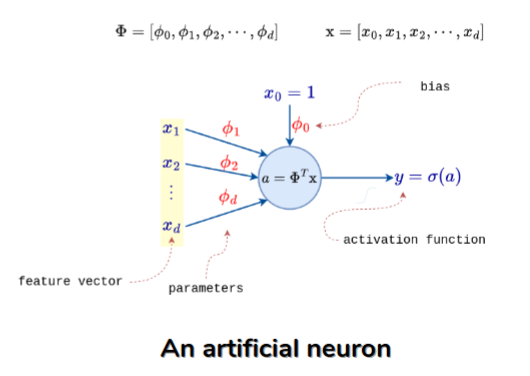
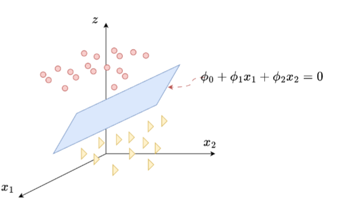
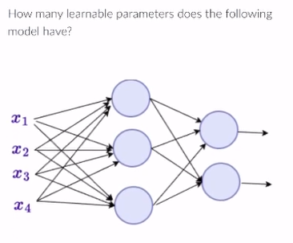
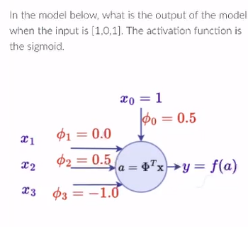
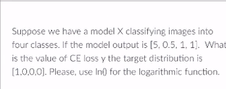

### control 3

#### Perceptron y MLP

El perceptrón representa la unidad mínima de procesamiento en una red neuronal artificial, con un comportamiento similar al de una regresión logística.

Los valores de entrada se representan con $x_i$, y los parámetros se representan con $\phi_i$.\
El valor de agregación es la suma ponderada del vector de entrada con respecto al vector de parámetros: $$a = \sum_{i=0}^{d} x_i \phi_i$$\
Esto se puede representar como el producto punto entre el vector $x$ y el vector de parámetros: $$a = \phi^T x$$.\
El valor de activación se calcula a través de una función generalmente no lineal sobre el valor de agregación, es decir, $y = f(a)$.

#### Geométricamente

Un perceptrón se representa como un hiperplano clasificador, es decir, separa el espacio en dos partes.

#### Función de pérdida

Mide el error entre la predicción $\hat{y}$ y el valor real $y$.

- MSE: diferencia entre la predicción y el valor real 

$$l_i(\phi,x_i) = \frac{1}{2}(\hat{y_i}-y_i)^2$$

- BCE: maximiza las salidas para que sean 1 o 0

$$l_i(\phi,x_i) = -[y_i \log(\hat{y_i}) + (1-y_i) \log(1-\hat{y_i})]$$

Para ambos casos se calcula de forma general:

$$l(\phi,x) = \frac{1}{N}\sum_{i=1}^{N}l_i(\phi,x_i)$$

### Entrenamiento

Dado el conjunto de datos con $x$ e $y$ y teniendo un problema de clasificación binaria, vamos a utilizar la estrategia de descenso de gradiente (también se puede utilizar el ascenso de gradiente para el máximo verosimilitud), que actualiza los parámetros de la expresión:
$$\phi = \phi - \alpha \nabla_\phi l(\phi,x)$$

siendo $\alpha$ el learning rate 

#### MLP (Multilayer Perceptron)

Combina los perceptron organizando las neuronas por capas, cada neurona esta dotada de una funcion derivable no lineal como la:
- sigmoidal: 
    $$f(x) = \frac{1}{1+e^{-x}}$$

    $$f'(x) = f(x)(1-f(x))$$

- Tangente hiperbolica:
    $$f(x) = \frac{e^x-e^{-x}}{e^x+e^{-x}}$$

    $$f'(x) = 1-f^2(x)$$
- ReLU:
    $$f(x) = \max(0, x)$$

    $$f'(x) = \begin{cases} 
        0 & \text{si } x \leq 0 \\ 
        1 & \text{si } x > 0 
        \end{cases}$$

ejemplo propuesto:

para este ejemplo vemos que de entradad hay 4, la capa oculta tiene 3 neuronas y la de salida 2, la formula para contar esto es:
$$H(N+1)+K(H+1) = \text{parámetros aprendibles}$$
para este caso sabemos que:
- N = 4
- H = 3
- K = 2
osea segun la formula es la cantidad de neuronas de la capa por la entrada mas 1 por el bias

$3(4+1)+2(3+1) = 23$

Pregunta propuesta:

para resolver el siguente es primero calcular la sumatoria

$$(x_1*\phi_1)+(x_2*\phi_2)+(x_3*\phi_3)+(x_0*\phi_0)$$

$$(1*0)+(0*0,5)+(-1*1)+(1*0,5) = -0,5$$

cuando tenemos el resultado de esto hay que aplicarlo a la funcion sigmoidal

$$f(x) = \frac{1}{1+e^{-x}}$$

$$f(x) = \frac{1}{1+e^{-(-0,5)}} = 0,38\:\text{aprox}$$

Para solucionar esto hay que aplicar la funcion de CE loss:

$$-log[softmax(\hat{y^*})]$$

la de softmax es:
$$softmax = \frac{e^{z_i}}{\sum_{j=1}^{K}e^{z_j}}$$
entonces para el ejemplo tenemos
- $e^5 = 148,41$
- $e^{0,5} = 1,65$
- $e^1 = 2,72$

la suma de todas esas es $155,5$

aplicamos entonces 
- $\frac{148,41}{155,5} = 0,954$
- $\frac{1,65}{155,5} = 0,011$
- $\frac{2,72}{155,5} =0,017$

finalmente vemos las salidas y nos dice que es [1,0,0,0] por ende solo usaremos 
$-ln(0,954) = 0,047$

#### datos 

el mean square error se ocupa en casos no categoricos, cuando es regresion

el BCE se ocupa cuando es 1 o 0

